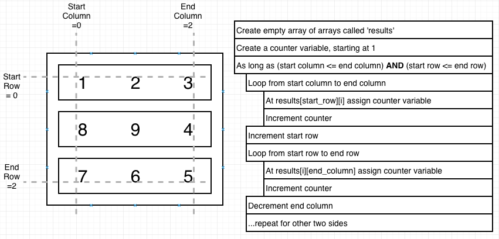

# Notes from Sections

**\*** **_Make sure to comment code during interviews to show what you're thinking and to keep track of what to do._**

**\*** **_A lot of these depend on creating your own variables to help track things (array index, values, etc), don't forget you can do this!_**

**\*** **_Remember to make helper functions if need be! For ex, check solution for Anangram checker_**

**\*** **_Always write a pseudocode solution before beginning coding on whiteboard. Helps you and interviewer understand what your process is_**

**\*** **_If asked about recursion, do iterative solution first, then refactor into recursive - will make life easier. Identify which variables are changing, identify base case_**

## Reverse a String

- Array.prototype.reverse() to reverse arrays
- Try to avoid classic for loop syntax b/c there are many places that can cause typos
- for...of loop for arrays and strings
- .reduce() to reverse string
  - acts like for loop
- use `debugger` and run file with `node inspect file.js`
  - `c` to continue until hit debugger, then type `repl` to ender JS env to test vars
  - make sure to manually call function that you want to debug, `inspect` runs fn that way

## Palindromes

- reverse string and boolean check against arg
- can use .every(), but not ideal solution
- `Array.prototype.every()` does boolean check on each array element
  - compare 1st and last elements, 2nd and penultimate, etc...
  - has double comparison **issue**: comparing first to last and then last to first is redundant.

## Reverse an Int

- `Math.sign(s)` returns 1 if x > 0, -1 if x < 0
  - can use this to multiply by number to produce + or - number, or in conditionals

## Max Chars

- Many variations of this string question regarding counting or comparing characters, all use same technique
  - Given a string, return the character that is most commonly used in the string.
  - What is the most common character in the string?
  - Does string A have the same character as string B (is it an anagram)?
    - build a char map for each string and compare
  - Does the given string have any repeated characters in it?
- Make a char map with an object {char: freq}
- Make maxVal = 0 and maxChar = '' vars to use in for...in iteration thru char map obj.

  ```javascript
  for (let char in charMap) {
    if (charMap[char] > max) {
      max = charMap[char];
      maxChar = char;
    }
  }
  ```

## FizzBuzz

- use modulo operator (%)
  - remember, can also be used for:
    - check for even by n % 2 === 0
    - check for odd by n % 2 !== 0

## Array Chunking

- last element of array => arr[arr.length - 1]
- think about an iterative solution for array chunking, grabbing last element in checking something.
- algo overview:
  ```javascript
  // create empty array to hold chunks 'chunks'
  // for each element in the passed in arr,
  // retrieve the last element in 'chunks' -> this will be a subarray
  // if that last element does not exist or its length === chunk size,
  // push new chunk into 'chunks' arr with current loop element inside,
  // else add current element to existing last element subarray chunk
  ```
- alternate solution using .slice()
  ```javascript
  // Create empty 'chunked' array
  // Create var 'index' set to 0
  // While index is less < array.length,
  // Push a slice of length 'size' from 'array' into 'chunked',
  // and add 'size' to 'index'
  ```

## Anagrams

- remove spaces by string -> array -> .filter(char => char !== ' ')
- replace everything in a string that's NOT alphanumeric with empty string ('') and make case insensitive
  - string.replace(/[^\w]/g, '').toLowerCase()
- 2 methods to solve
  - comparing character maps
    - make helper function to clean up string and make char map
    - check if # of keys in each char map matches
      - if not, return false, not an anagram
    - loop through one char map and check if key:val pairs match
      - if not, return false
      - if yes, return true
  - using sort, more concise, but has performance issues
    - make helper function to clean up string, convert to array, sort, then convert to string
    - check if helperFn(stringA) === helperFn(stringB)

## Sentence Capitalization

- 2 solutions
  - using slice() and charAt()/word[0]
    - make empty array 'words
    - split input string by spaces
    - for each word in split array
      - uppercase first letter and join with slice(1)
      - push result into 'words' array
        - can also change original string by setting each result equal to array[array.indexOf(word)], effectively reassigning the each index value to the new result.
    - return words.join(' ')
  - capitalize char if there's a space to the left of it
    - create 'result' string set to first char of the input string capitalized (b/c no space to the left of first char)
    - for each char in the input str (loop starts on i = 1 b/c first char in 'result' already)
      - if char to the left is a space
        - capitalize it and add it to 'result'
      - else
        - add it to 'result'

## The Steps Question

- think of output as a row/column matrix
- iterative solution - more straightforward, goto for interview
  - iterate through the rows from 0 to n
    - create empty string 'stair'
    - iterate through columns from 0 to n
      - if current column <= current row
        - add a '#' to 'stair'
      - else
        - add a space to 'stair
    - console.log('stair')
- recursion

  - first thing to do is to identify the base case
    - base case: when no more work to do, time to return and stop recursion
  - when calling fn again for recursion, important to change the arguments somehow, otherwise, infinite loop of the same thing.
  - recursion tips
    - figure out the bare minimum pieces of information to represent your problem
    - give reasonable defaults to the bare minimum pieces of info to safely handle recurions
    - Check the base case. Is there any work left to do? If not, return
    - Do some work. Call fn again, making sure the args have changed in some fashion.
  - Ex:

    ```javascript
    function printNumber(n) {
      // below is the base case
      if (n === 0) {
        return;
      }

      console.log(n);
      printNumber(n - 1); // arg is changed
    }

    printNumber(10);
    ```

## Pyramids

- 2 x number of rows - 1 = number of columns
- iterative & recursive solution
- iterative
  - similar to steps, but have to consider both ends of each level
  - find midpoint using `Math.floor((2 \* n - 1) / 2)`
  - for each row (0 to n)
    - create empty string 'level'
    - for each column (0 to 2 \* n - 1)
      - check to the left and right of the midpoint by 'row' number of elements
        - if midpoint - current row <= current column && midpoint + current row >= current column
          - add '#'
        - else
          - add ' '
    - console.log(level)

## Count Vowels

- iterative and regex solutions
- iterative
  - create a counter variable
  - iterate through string
    - if char of string is a vowel, increment counter
  - return counter
- regex
  - using [] within regex // tells match to check all chars in []
  - /g for regex means don't stop after first match, keep going
  - /i for case insensitive
  - .match returns an array of matches or null if nothing matches
    - have to manage the return of null if no matches are found and make it return 0

## Spiral Matrix

- spiral matrix
  - an array of subarrays
  - counts in an inward, clockwise spiral
  - last number of spiral is n\*\*2
- make sure to plan ahead and pseudocode
- first step: make empty array of subarrays, don't plan on inserting arrays during loops.
  - loop 'n' times and for each create a subarray
- use starting and ending counters (row and column) to keep track of what portion of matrix we're focusing on, which restricts where for loops run and add to subarrays.
- some subarrays require moving from right to left, so make sure for loops have flipped logic (i >= ...) and decrement instead of increment (i--)
  

## Runtime Complexity

- desribes performance of an algorithm
  - how much more processing power/time is req'd to run algo if inputs are doubled?
- interviewers will ask what runtime complexity is for your solution
- String Reversal algo
  - iterative solution
    - 1 additional loop for each additional character
    - N (linear) runtime
    - direct 1:1 relationship between input and computational power
- Steps algo
  - 2 nested for loops
    - as input 'n' increased, had to do n\*\*2 things
    - N^2 (quadratic) runtime
- Constant Time
  - N
  - no matter how many elements, the operation will always take the same amount of time
  - holy grail
- Logarithmic Time
  - log(n)
  - when doubles number of elements you're iterating over doesn't double amount of work.
  - Searching a sorted array are log(n)
- Linear Time
  - n
  - when iterating through all elements in a collection of data
  - if you see a for loop from '0' to 'array.length0 => you have O(n)
- Quasilinear Time
  - n \* log(n)
  - when doubling number of elements iterating over doesn't double work
  - it's 1 + a little bit
  - Sorting operations are n\*log(n)
- Quadratic Time
  - n^2
  - every element in collection has to be compared with every other element.
  - 'Handshake problem' - when new person in a room, have to shake hands with everyone else
- Exponential Time
  - 2^n
  - horrible time complexity
  - adding a single element to a collection requires double the processing power
- Big O Notation
  - representing time complexity/runtime/efficiency
  - O(n) - linear, O(1) constant, O(n^2) quadratic

### Identifying Runtime Complexity

- Iterating with a simple for loop through a collection?
  - Probably O(n)
- Iterating through half a collection
  - Still O(n), b/c there are no constants in runtime
- Iterating through 2 different collections with separate for loops?
  - O(n + m)
- Two nested for loops iterating over same collection?
  - O(n^2)
- Two nested for loops iterating over different collections?
  - O(n\*m)
- Sorting?
  - O(n\*log(n))
- Searching a sorted array?
  - O(log(n))

### Space Complexity

- How much more memory is required by doubling problem set?
- How many elements do we need to store in memory during operation?
- Runtime complexity and space complexity can be identical, but not always

## Fibonacci

- 2 solutions: iterative and recursive
- iterative solution
  - set an array equal to [0,1] b/c no for loop will be able to produce the first 2 elements
  - loop from 2 to and including n, add arr[i-1] + arr[i-2], push to arr.
  - return arr[n]
- recursive solution is difficult to come up with. If you get it, it's most likely because you've seen it before and memorized it.
  - set up base case of if n < 2, return n
  - return fib(n - 1) + fib(n-2)
    - keep calling fib on smaller bits of itself until it meets the base case, then add all fib(1) results.
- recursive solution = O(2^n) exponential runtime
  - for each increment for value n, there's a dramatic increase in operations required to evaluate
- ### **Memoization**
  - if interviewer asks if anything can be done to improve runtime of recursive solution, say **MEMOIZATION!**
  - avoiding duplicate calls
  - store args of each fn call along with the result
    - if fn called again with same args, return the stored result, instead of funning fn again
    - caching a table in memory
  - write a memoize fn that takes slow fn and returns fast, memoized fn
  - set a fasterFn = memoize(fn), then call fasterFn()

# Data Structures

### all about runtime complexity

- Data structures - ways of organizing information with optimal 'runtime complexity' for adding or removing records
- when asked to solve a problem, automatically think what data structure should be used to solve this with optimal runtime complexity

## Queue

- like waiting in line, a queue
- one end for entry, one end for exist
- order matters - ordered list
- adding (enqueuing) and removing (dequeuing)
- FIFO (first in, first out) principal
  - first record removed is first one entered
- immplent queue via by making a Queue Class using a JS array
  - add: array.unshift()
  - remove: array.pop()
    - keep in mind that both methods edit original array
  - pretty much handicaping a JS array and restricting it to only do these 2 methods
- make a class Queue {}
  - constructor includes this.data = []
  - add method uses unshift(record)
  - remove method uses pop() and returns result

### Weave problem

- add a peek method to Queue class that returns last item that's next to be removed.
- create a new queue (q3)
- while q1.peek() or q2.peek() exist (i.e. queues aren't empty)
  - if q1.peek()
    - q3.add(q1.remove())
  - if q2.peek()
    - q3.add(q2.remove())
- return q3
- while loop and if statements make sure that no 'undefined' is placed withing combined weave.

## Stack

- similar to a queue
- ordered list of records within a container
- FILO (first in, last out)
  - think call stack in JS
  - add to stack (push)
  - remove from stack (pop)
- implementing a stack is similar to implementing a queue
  - make a Stack Class
  - add: array.push()
    - vs. array.unshift() for a queue
  - remove: array.pop()
- can also implement stack by using .unshift to add and .shift to remove, same thing as .push and .pop, just at beginning of array instead of at the end. Only difference would be the index value where .peek method should look.

### Queue from Stack Question

- most common question to see around queues and stacks
